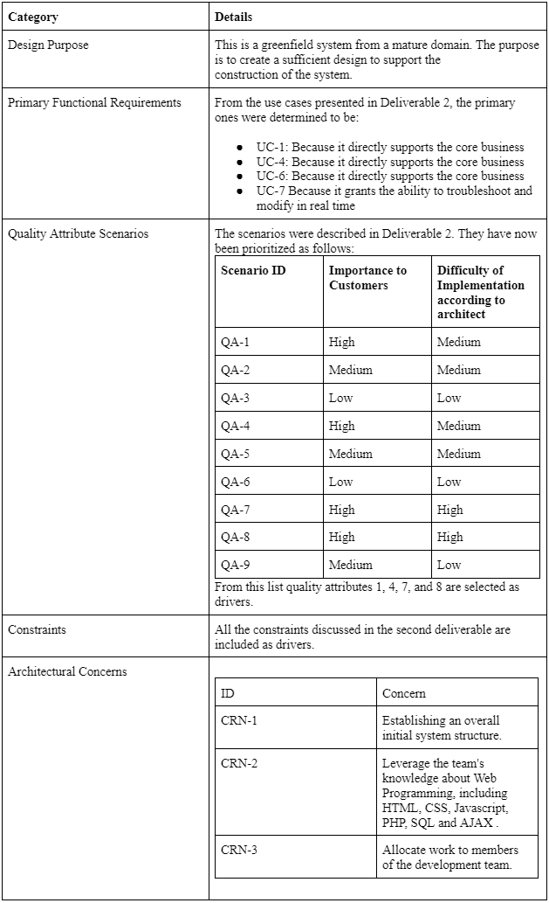
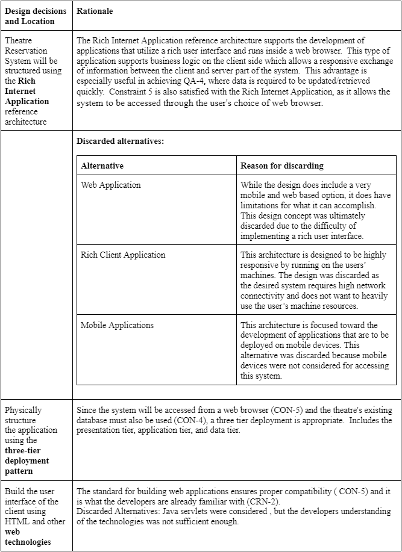

# Iteration 1 : Establishing an Overall System Structure
This iteration showcases the results of the activites that are performed for the first iteration of the add process. The goal of this iteration is to establish an overall system structure.

To access to full pdf click [here](Iteration%201%20Final%20Project%20SOFE3650.pdf)

## **ADD Step 1: Review inputs**

## **Step 2: Establish Iteration Goal by Selecting Drivers**

This is the first iteration in the design of a greenfield system, so the iteration goal
is to achieve the first architectural concern of establishing an overall system structure .
Although this iteration is driven by a general architectural concern, the architect must keep in mind all of the drivers that may influence the general structure of the system. In particular, the architect must be mindful of the following:

[QA-1: Security](/assets/qualityAttributes.JPG)  

[QA-4: Performance, Availability](/assets/qualityAttributes.JPG)  

[QA-7: Security](/assets/qualityAttributes.JPG)  

[QA-8: Security](/assets/qualityAttributes.JPG)

[CON-2: User workstations use the following operating systems: Windows and Linux.](/assets/systemConstraints.JPG)

[CON-4: Must use the theatre's existing databases.](/assets/systemConstraints.JPG)

[CON-5: The system must be accessed through a web browser such as Chrome or Firefox while on different operating systems.](/assets/systemConstraints.JPG)

[CRN-2: Leverage the team's knowledge about Web technologies, including HTML, CSS, Javascript, PHP, SQL and AJAX.](/assets/crn.JPG)  

Context Diagram for the theatre reservation system:  

## **Step 3: Choose One or More Elements of the System to Refine**

Our system is a greenfield system, so the element to refine is the entire theatre reservation system, which is shown in the diagram above. Refinement is performed through decomposition.

## **Step 4: Choose One or More Design Concepts That Satisfy the Selected Drivers**

## **Step 5: Instantiate Architectural Elements, Allocate Responsibilities, and Define Interfaces**

In the initial iteration, interfaces are not yet defined. 

|**Design Decision and Location**|**Rationale**|
| :- | :- |
|Remove local data sources in the Rich Internet Application|No need to store data locally as information will be stored in the Theatre Database.|

## **Step 6: Sketch Views and Record Design Decisions**  
  
The following table summarizes the information that is captured by the sketch : 
|**Element**|**Responsibility**|
| :- | :- |
|Browser Layer|This layer contains the canvas for user interaction and use case control flow.  Will use HTML and CSS to implement. |
|Service Interface|Various service components are utilized by the end users.|
|Business Layer|This layer contains the modules that perform the business logic operations.  This can be carried out on the server side.|
|Data Layer|This layer houses the components needed to communicate with the theatre server. |
|Cross Cutting|This extra hidden layer contains the website's security, operational management, and communication with the theatre database server.  The service, business, and data layer all make use of this helpful layer. |
|Rich UI Engine|This highly interactive user interface will make the software feel more responsive to the end user.|
|Business Processing Component|Element will send and receive delicate information from the client and server sides.|
|Message Types|Contains the appropriate class of variable to send or receive.|
|Business Components |Incorporate business operations  that require processing on the server side. |
|Business Entities|These entities make up the domain model. |
|Access Module|Retrieves data from theatre database.|
|Data Utilities|Tools in order to retrieve and collect data. Used in the business layer. |

Deployment Diagram:  
  
The responsibilities of the elements are:

|**Element**|**Responsibility** |
| :- | :- |
|User Device|The device (most likely a pc), which houses the client side logic part of the program|
|Application Server|The server that host the server side logic of the program, it also serves the web pages|
|Database Server|Server that hosts the the relational database|
The relationship between elements:

|**Relationship**|**Description**|
| :- | :- |
|Between application and database server|Communication with the database will be done using PHP.|

## **Step 7: Perform Analysis of Current Design and Review Iteration**

|**Not Addressed**|**Partially Addressed**|**Completely Addressed**|**Design Decisions** |
| :- | :- | :- | :- |
||UC-1||Selected reference architecture establishes the modules that will support this functionality.|
||UC-4|||
||UC-6|||
||UC-7|||
||QA-4||Introduced business logic module on the client side to provide fast and secure data transfer. |
|||CON-5|Use of the Rich Internet Application being programmed in Java, which supports the website across different browsers and operating systems.|
||QA-1||Selected relevant drivers.|
||QA-4|||
||QA-7|||
||QA-8|||
|||CRN-2|Leverage the team's knowledge about Web technologies, including HTML, CSS, Javascript, PHP, SQL and AJAX . |
||CON-2||Took into account the following elements, mindful while deciding project drivers. |
||CON-4|||
|UC-2|||No relevant decisions made, elements did not fit this iterations scenario. |
|UC-3|||No relevant decisions made, elements did not fit this iterations scenario. |
|UC-5|||No relevant decisions made, elements did not fit this iterations scenario. |
|UC-8|||No relevant decisions made, elements did not fit this iterations scenario. |
|QA-2|||No relevant decisions made, elements did not fit this iterations scenario. |
|QA-3|||No relevant decisions made, elements did not fit this iterations scenario. |
|QA-5|||No relevant decisions made, elements did not fit this iterations scenario. |
|QA-6|||No relevant decisions made, elements did not fit this iterations scenario. |
|QA-9|||No relevant decisions made, elements did not fit this iterations scenario. |
|CON-1|||No relevant decisions made, elements did not fit this iterations scenario. |
|CON-3|||No relevant decisions made, elements did not fit this iterations scenario. |
|CON-6|||No relevant decisions made, elements did not fit this iterations scenario. |

