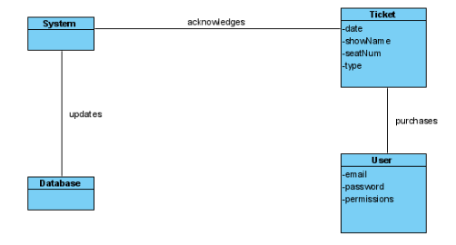
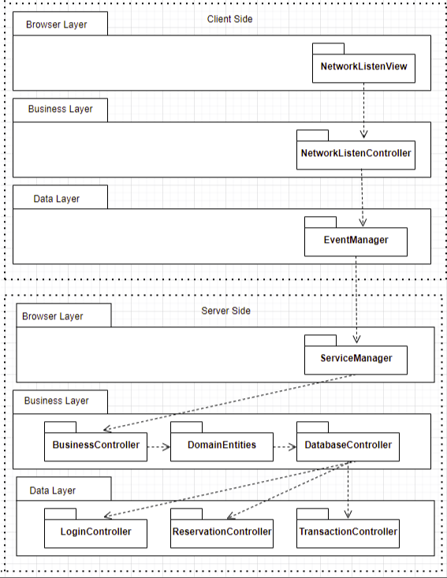

# Iteration 2 : Identifying structures to support primary functionality
This iteration showcases the results of the activites that are performed for the second iteration of the add process. The goal of this iteration is to address the architectural concern of identifying structures to support primary functionality.

To access to full pdf click [here](Iteration%202%20Final%20Project%20SOFE3650.pdf)

**Step 2: Establish Iteration Goal by Selecting Drivers**

The goal during this iteration is to address the architectural concern of identifying structures to support primary functionality. This is not only useful for understanding how functionality is supported, but also for addressing CRN-3 (Allocate work to members of the development team.)

In this iteration the architecture considers:

- UC-1
- UC-4
- UC-6
- UC-7
- CRN-3

**Step 3: Choose One or More Elements of the System to Refine**

The elements that will be refined in this iteration are the modules located in the layers defined by the two reference architectures from the first iteration. In general, the support of functionality in this system requires the collaboration of components associated with modules that are located in the different layers.  This includes the elements browser layer, business layer, and data layer.

**Step 4: Choose One or More Design Concepts That Satisfy the Selected Drivers**

|**Design Decisions and Location**|**Rationale and Assumptions**|
| :- | :- |
|Create a **Domain Model** for the Application|The initial domain model is necessary before starting decomposition, as it is the conceptual model that incorporates both behaviour and data in our system.  A domain model will guide us to create and understand the entity relationships within our system, and will prevent an ad hoc architecture that is difficult to work with. |
|Identify **Domain Objects** that map to functional requirements |We can convert the client/server side layers from our system into individual domain objects, in which each object can be expanded on.  This process eliminates the risk of not considering requirements. |
|Decompose **Domain Objects** into general and specialized **Components**|Each domain object will be fully functional as a set, but can be decomposed into smaller components. For example, the data layer can be decomposed into an access module that is connected with the Theatre Database.|
|Use JQuery Framework|
JQuery is a popular framework/library to support javascript development . A library is required in order to use Ajax in the program, and it was the library that integrated the most with our program.

An alternative that was considered for development was React. JQuery was selected as it has better compatibility, and that React is too complex for the program we are trying to create. 
|

**Step 5: Instantiate Architectural Elements, Allocate Responsibilities, and Define Interfaces**

|**Design Decisions and Location**|**Rationale** |
| :- | :- |
|Creating the initial domain model|An initial domain model is created as the base for the system, allowing straightforward identification and modelling for the primary use cases. |
|Map the system use cases to domain objects|The domain objects are identified and are found in the use cases from the use case model in deliverable 2 |
|Decomposition of domain objects|This technique helps allocate work to the team through identifying modules that support the project's functionalities.|
|Connect components using JQuery Framework|JQuery simplifies the relationship between Javascript code and HTML elements, supporting various component aspects with a wide range of plugins. |

**Step 6: Sketch Views and Record Design Decisions**

Initial Domain Model:  

Module that support the primary use cases:  

|**Element**|**Responsibility**|
| :- | :- |
|NetworkListenView|This component is in charge of processing the user interface components from the reference architecture.  Displays the network events and updates accordingly when called. |
|NetworkListenController|Provides relevant information to the browser layer and displays the current event.|
|EventManager|Communicates with the server-side logic|
|ServiceManager|Manages various services that receive requests from the client side. |
|BusinessController|Contains relevant business logic. |
|DomainEntities|Comprises entities from the server side domain model.|
|DatabaseController|Encompasses logic to fetch and store data. |
|LoginController|Determines whether the current user is of type regular or admin. |
|ReservationController|Create and destroy reservations|
|TransactionManager|Connect to clients payment provider|

Sequence diagram for use case UC-1 (Login System)

Initial methods for the interfaces of the interacting elements can be identified:

|**Method Name**|**Description**|
| :- | :- |
|**Element**: NetworkListenController|
|Boolean initialize()|Creates the network for user interface. |
|**Element**: EventManager|
|Event requestParent() |Returns a reference of the event parent node. |
|**Element**: ServiceManager|
|sendRequest(request req)|Allows for branching of new functionalities, navigating through the EventManager.  Receives requests from the EventManager.  |
|**Element**: BusinessController|
|publish(Event event)|Notifies the client of a new event. |
|Data getRequest()|Requests the topology of the parent node to determine the request and to navigate through the business layer. |
|**Element**: DatabseController|
|Data DatabaseStore(int id)|Utilizes a hash table to store/update relevant reservation information quickly (admin access). |
|Data DatabaseRetrieve(int id)|Utilizes a hash table to retrieve relevant reservation information quickly (such as performance description, time, and price). |
|**Element**: LoginController|
|user getUser(user userID)|Locates the user's tuple in the database.  Returns user information|
|**Element**: TransactionManager|
|Int connectPayment()|Connect to users' payment providers using their associated information. |

**Step 7: Perform Analysis of Current Design and Review Iteration**

|**Not Addressed**|**Partially Addressed**|**Completely Addressed**|**Design Decisions** |
| :- | :- | :- | :- |
|||UC-1|Modules across the layers and preliminary interfaces to support this use case have been identified. |
|||UC-4||
|||UC-6||
|||UC-7||
||QA-1||The elements that support the associated use case (UC-1) have been identified. |
||QA-4||The elements that support the associated use case have been identified. |
||QA-5||The elements that support the associated use case (UC-7) have been identified. |
||QA-7||The elements that support the associated use case (UC-1) have been identified. |
||QA-9||The elements that support the associated use case (UC-4) have been identified. |
||CON-1||No relevant decisions have been made|
||CON-2||No relevant decisions have been made|
|||CRN-3|Modules associated with all of the use cases have been identified and a work distribution has been created.|

